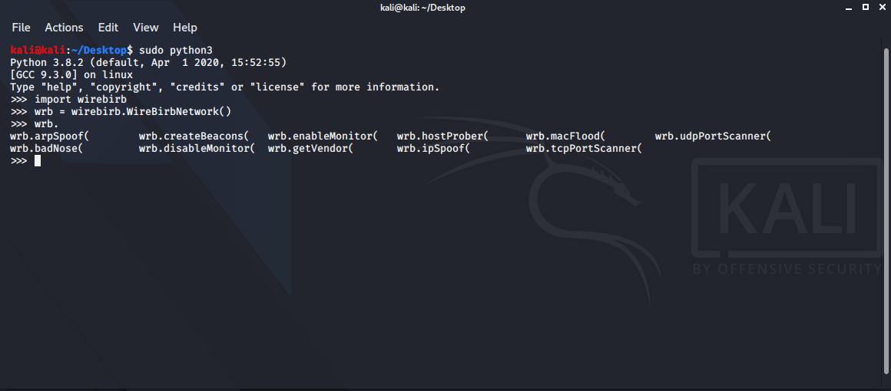

# WireBirb
[](https://www.python.org/)<br>
A scapy based module for programming offensive and defensive networking tools easier than before.<br>
<b> Warning:</b><i> Usage of WireBirb for attacking targets without prior mutual consent is illegal. It's the end user's responsibility to obey all applicable local, state and federal laws. Developers assume no liability and are not responsible for any misuse or damage caused by this module </i>

# Screenshot


##Help
<b>You can use ```help(wirebirb)``` function to see usage of all methods</b>
